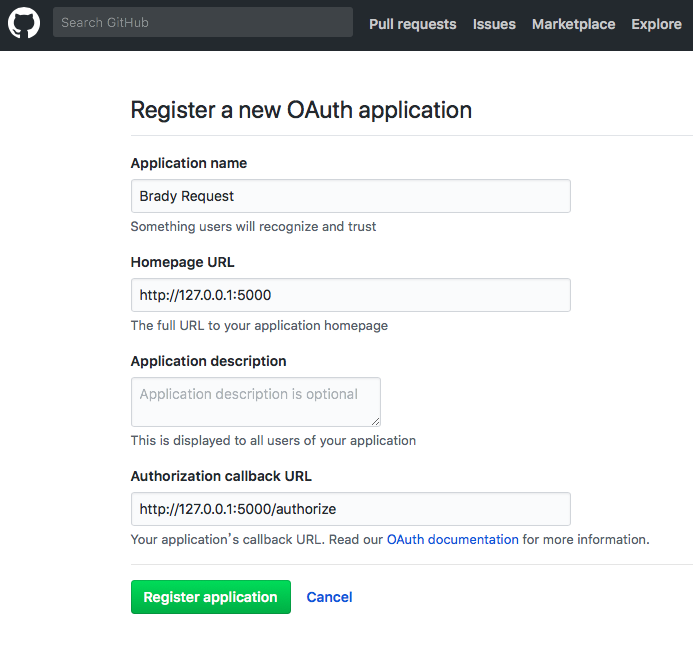
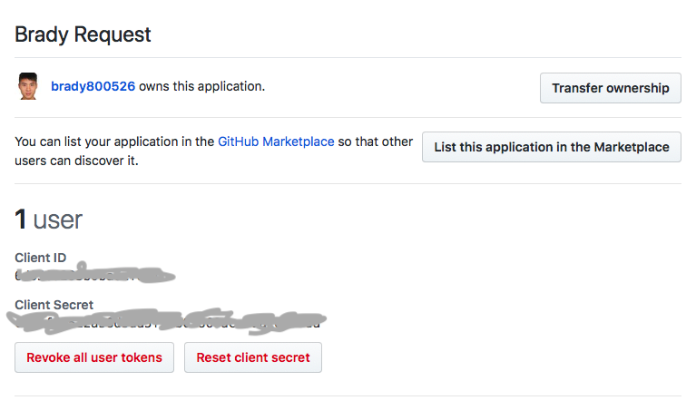
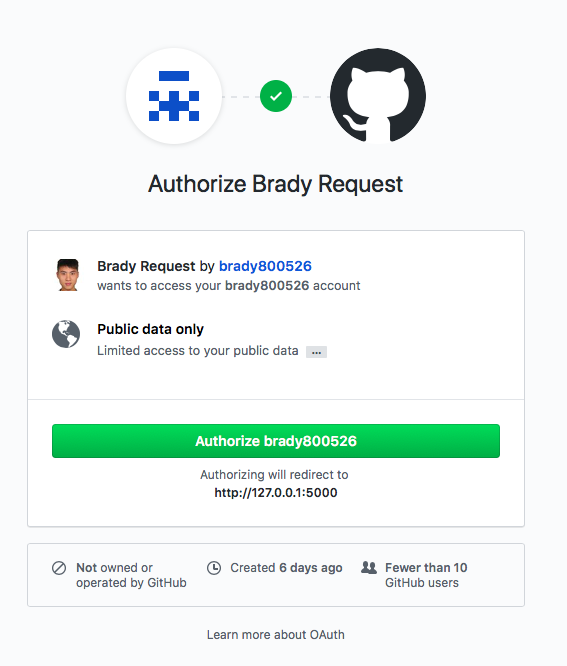

## Summary

This repo is a practice of using Python Flask Framework to build an Github OAuth app for acquiring the user Github info.
*All the step is followed by Pretty Printed website [LEARN PYTHON REQUESTS](https://prettyprinted.com/courses/enrolled/215307).*

## OAuth (Open Authentication)

#### Wikipedia
*OAuth is an open standard for access delegation, commonly used as a way for Internet users to grant websites or applications access to their information on other websites but without giving them the passwords. This mechanism is used by companies such as Amazon, Google, Facebook, Microsoft and Twitter to permit the users to share information about their accounts with third party applications or websites.*

*Generally, OAuth provides to clients a "secure delegated access" to server resources on behalf of a resource owner. It specifies a process for resource owners to authorize third-party access to their server resources without sharing their credentials. Designed specifically to work with Hypertext Transfer Protocol (HTTP), OAuth essentially allows access tokens to be issued to third-party clients by an authorization server, with the approval of the resource owner. The third party then uses the access token to access the protected resources hosted by the resource server.*

##### In Brief
When the third-party application want to access your information on certain HTTP service like Github. In tradition, you will need to give the app your account and password which is definitely not safe because the app can save your account and password.

By using OAuth, you can grant the third-party app without your password. For instance, when user grant the app to use their Github personal info. The app will only render Github account and give the app an Authentication Token, then the app can access Github personal information with attached Authentication Token in the request parameters.

## Architecture

<figure style="text-align: center;">
    
    <figcaption style="display: block;">OAuth Flowchart</figcaption>
</figure>

1. When user opens the client app, client app requests user authentication for the Github account
2. User authenticate the client app to access Github account and respond the user Grant Code back to the client app
3. Client app use the Grant Code responded by the Github in last step and send it to Authentication Server
4. Authentication Server confirm the Grant Code and send the Access Token back to the client app
5. The client app requests Resource Server for the resource by using the Access Token
6. Resource Server confirm the Access Token and send back the user's Github info.

## Usage

#### Build Github OAuth App

Go [here](https://github.com/settings/applications/new) (Login your account first) and name your OAuth App, OAuth app is an authentication layer to authenticate user if they want to access user info. Here, I name the app with **Brady Request**. The Homepage URL is for user to know which web app is requesting your authentication, and callback url is for putting a endpoint to get the Authentication Code from Github Account.

<figure style="text-align: center;">
    
    <figcaption style="display: block;">Create OAuth App</figcaption>
</figure>

In the app, you can see your Client_ID and Client_Secret.

<figure style="text-align: center;">
    
    <figcaption style="display: block;">OAuth App Info</figcaption>
</figure>

Remenber the Client ID and Secret. Here, we will save these into separte file for safe in client_secret.py and we should not put it on the net.

#### Use the Github OAuth App

Download the repo, and under the directory enter:

    python app.py

The default port for this app is 5000, so the URI is http://127.0.0.1:5000.

<figure style="text-align: center;">
    
    <figcaption style="display: block;">Landing Page</figcaption>
</figure>

We simply show "Login with Github" and the hypertext will link to the Github OAuth app which is used for authentication.

<figure style="text-align: center;">
    
    <figcaption style="display: block;">Login the Github</figcaption>
</figure>

By entering our Github account, the app can access the personal information on your Github. The documentation for the information you can access from user Github is over [here](https://developer.github.com/v3/) and you will see all the repos you have for now.

## Code

#### Setting
------------------------------------------------------------------------

app.py
```
import requests
from flask import Flask, request
from client import CLIENT_ID, CLIENT_SECRET

app = Flask(__name__)
```

#### index endpoint - Show the link to Github OAuth App
------------------------------------------------------------------------

app.py
```
from client_secret import CLIENT_ID, CLIENT_SECRET
CLIENT_ID = CLIENT_ID

@app.route('/')
def index():
    return '<a href="https://github.com/login/oauth/authorize?client_id={}">Login with Github</a>'.format(CLIENT_ID)
```

There is a client_secret.py file includes save your client_id and client_secret. Here, we shouldn't provide these info to others.
By clicking the hyperlink, we will be directed to Github to login our account.

#### authorize endpoint - Get the code and requests for access token
------------------------------------------------------------------------

app.py
```
@app.route('/authorize')
def authorize():
    code = request.args.get('code')
    data = {'code': code, 'client_id': CLIENT_ID, 'client_secret': CLIENT_SECRET}
    headers = {'Accept': 'application/json'}

    r =requests.post(GITHUB_TOKEN_URL, data=data, headers=headers)
    ...
```

Once successfully logged in, our callback url will get a value from code key. Then we send a POST request with code, CLIENT_ID and CLIENT_SECRET. We can specify the response type to be json type, then we can easily process the response.

```
@app.route('/authorize')
    ...
    token = r.json()['access_token']
    headers['Authorization'] = 'token {}'.format(token)
    r2 = requests.get(BASE_URL + '/user/repos', headers=headers)

    repos = r2.json()

    list_of_repos = []

    for repo in repos:
        list_of_repos.append(repo['name'])

    return '<br>'.join(list_of_repos)
```

The resoponse will contain access token, we use this token attached to our parameters and request for the user resource in Github. In this case, we request for all the repos user has and print it on this route.

## Conclusion

In this project, we use Github OAuth App to authenticate our third-party app to request for user Github info. With the official documentation, we can do much more things than simply take just see the user repos name.

## Reference

1. [理解OAuth 2.0 - 阮一峰的网络日志](http://www.ruanyifeng.com/blog/2014/05/oauth_2_0.html)
2. [OAuth 2.0 筆記(1) 世界觀- Yu-Cheng Chuang's Blog](https://blog.yorkxin.org/2013/09/30/oauth2-1-introduction)
3. [RFC 6749](https://tools.ietf.org/html/rfc6749)
